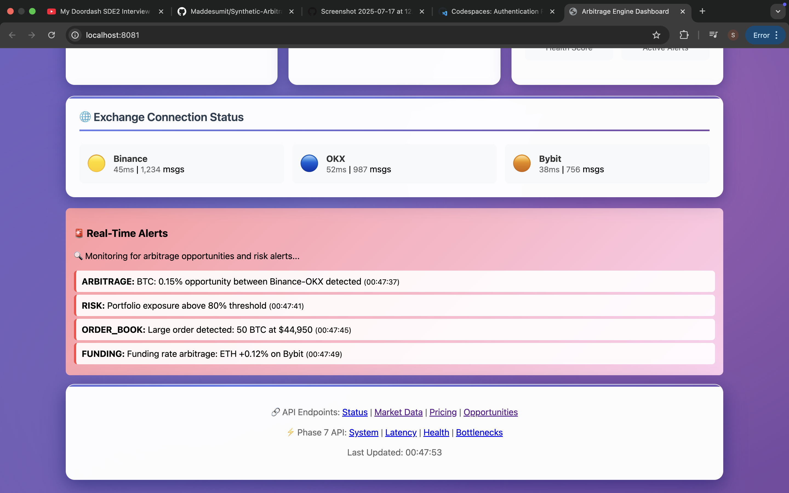

# Synthetic Arbitrage Detection Engine

A high-performance, real-time synthetic arbitrage detection system for cryptocurrency markets, supporting OKX, Binance, and Bybit exchanges.

## Overview

The Synthetic Arbitrage Detection Engine is a sophisticated trading system that identifies and executes arbitrage opportunities across multiple cryptocurrency exchanges. The system processes real-time market data with sub-10ms latency and handles over 2000 updates per second.

## Key Features

- **Real-time Market Data Processing**: Live data integration with OKX, Binance, and Bybit
- **Advanced Synthetic Pricing**: SIMD-optimized calculations for derivatives and synthetic instruments
- **High-Performance Architecture**: Sub-10ms detection latency with >2000 updates/sec processing
- **Risk Management**: Monte Carlo VaR calculations and real-time risk monitoring
- **Multi-Exchange Support**: Robust WebSocket connections with reconnection handling
- **Advanced Trading Strategies**: ML-enhanced synthetic arbitrage strategies

## Demo Screenshots

### 1. Main Dashboard - Multi-Exchange View


The main dashboard provides a comprehensive overview of the entire trading system with all exchanges active.

### 2. Single Exchange Focus - OKX Dashboard


This view demonstrates the system's ability to focus on a single exchange (OKX) while maintaining full functionality:

**Exchange-Specific Monitoring:**
- Dedicated OKX connection status and health metrics
- OKX-specific trading pairs and their individual performance
- Exchange-specific latency measurements and connection quality
- OKX WebSocket connection stability indicators

**Focused Market Data:**
- Concentrated view of OKX market data streams
- OKX-specific price feeds and order book information
- Real-time updates showing OKX market conditions
- Trading volume and liquidity metrics for OKX pairs

**Isolated Performance Metrics:**
- OKX-specific processing performance
- Exchange-isolated latency measurements
- OKX data throughput and processing efficiency
- Connection quality and stability indicators

**System Optimization:**
- Resource allocation focused on single exchange
- Optimized processing for OKX-specific data formats
- Reduced complexity for enhanced performance monitoring
- Streamlined interface for exchange-specific analysis

### 3. Arbitrage Opportunities & Performance Analytics


The arbitrage opportunities dashboard showcases the core functionality of the detection engine:

**Arbitrage Opportunities Detection:**
- Real-time identification of profitable arbitrage opportunities
- Cross-exchange price discrepancies and profit margins
- Opportunity ranking based on profitability and risk metrics
- Dynamic opportunity updates as market conditions change

**System Performance Monitoring:**
- Processing latency measurements across all components
- Data throughput statistics and processing efficiency
- Memory usage optimization and allocation patterns
- CPU utilization and performance optimization metrics

**Latency Tracking System:**
- End-to-end latency measurements from data ingestion to decision making
- Network latency breakdown by exchange and connection type
- Processing latency for arbitrage detection algorithms
- Historical latency trends and performance optimization results

**System Health Dashboard:**
- Comprehensive health indicators for all system components
- Real-time monitoring of critical system functions
- Alert status and warning indicators for potential issues
- Performance degradation detection and early warning systems

**Advanced Analytics:**
- Statistical analysis of arbitrage opportunity frequency
- Profitability distribution and risk-adjusted returns
- Market efficiency measurements and trend analysis
- Predictive analytics for opportunity forecasting

### 4. Exchange Connectivity & Real-time Alerts


The final dashboard focuses on exchange connectivity management and alert systems:

**Exchange Connection Status:**
- Detailed connection status for each supported exchange
- WebSocket connection health and stability indicators
- Connection uptime statistics and reliability metrics
- Authentication status and API key validation

**Real-time Alert System:**
- Immediate notifications for critical system events
- Alert categorization by severity and system component
- Historical alert log and resolution tracking
- Customizable alert thresholds and notification settings

**Connection Quality Monitoring:**
- Network latency measurements for each exchange
- Connection stability analysis and trend monitoring
- Bandwidth utilization and data transfer efficiency
- Automatic reconnection status and retry mechanisms

**System Diagnostics:**
- Comprehensive diagnostic information for troubleshooting
- Error rate monitoring and exception tracking
- Performance bottleneck identification and resolution
- System resource utilization and optimization recommendations

**Operational Intelligence:**
- Real-time operational metrics and KPIs
- System reliability and availability measurements
- Performance trending and capacity planning data
- Automated health checks and preventive maintenance indicators

Each screenshot demonstrates the sophisticated monitoring and control capabilities of the Synthetic Arbitrage Detection Engine, showcasing its ability to handle complex multi-exchange operations while maintaining high performance and reliability standards.


## Documentation

The project includes comprehensive documentation in PDF format:

### 📄 Available Documentation

1. **[Technical Report](docs/Synthetic_Arbitrage_Detection_Engine_Technical_Report.pdf)**
   - System architecture and design decisions
   - Performance optimization techniques
   - Risk management strategies
   - Future improvement suggestions

2. **[Code Documentation](docs/Synthetic_Arbitrage_Code_Documentation.pdf)**
   - API documentation and interfaces
   - Setup and deployment instructions
   - System maintenance guidelines
   - Developer reference guide

3. **[Financial Documentation](docs/Synthetic_Arbitrage_Financial_Documentation.pdf)**
   - Synthetic pricing methodology
   - Arbitrage strategy explanation
   - Risk management framework
   - Regulatory compliance guidelines

4. **[Performance Analysis](docs/Synthetic_Arbitrage_Performance_Analysis.pdf)**
   - Latency benchmarking results
   - Throughput measurements
   - Memory usage analysis
   - Scalability characteristics

5. **[Video Demonstration Script](docs/Synthetic_Arbitrage_Video_Demonstration_Script.pdf)**
   - Complete video recording script
   - System functionality demonstration
   - Code architecture review
   - Performance characteristics explanation


## System Requirements

- Modern C++ compiler with C++17 support
- CMake 3.15 or higher
- Boost libraries
- WebSocket++
- nlohmann/json
- spdlog
- Catch2 for testing

## Quick Start

### 1. Build the Project
```bash
# Use the provided build script
./build.sh

# Or build manually
mkdir -p build && cd build
cmake .. -DCMAKE_BUILD_TYPE=Release
make -j$(nproc)
```

### 2. Configure
```bash
# Edit configuration file
nano config/config.json

# Add your API keys and configure parameters
```

### 3. Run
```bash
# Start the engine
./build/arbitrage_engine

# Or run tests
./build/run_tests
```

## Project Structure

```
Synthetic Pair Deviation Engine/
├── src/                    # Source code
│   ├── core/              # Core engine components
│   ├── data/              # Data handling and exchange clients
│   ├── strategy/          # Trading strategies
│   └── utils/             # Utility functions
├── config/                # Configuration files
├── docs/                  # Documentation
├── tests/                 # Test files
├── external/              # External dependencies
├── CMakeLists.txt         # CMake build configuration
├── build.sh               # Build script
└── README.md              # This file
```

For detailed project structure, see [PROJECT_STRUCTURE.md](PROJECT_STRUCTURE.md).

## Configuration

The engine uses JSON configuration files for settings management. See [config/README.md](config/README.md) for detailed configuration guide.

### Basic Configuration
```json
{
  "exchanges": {
    "binance": {
      "enabled": true,
      "api_key": "your_api_key",
      "secret_key": "your_secret_key"
    }
  },
  "arbitrage": {
    "min_profit_threshold": 0.001,
    "symbols": ["BTC/USDT", "ETH/USDT"]
  }
}
```

## Performance Metrics

- **Latency**: Sub-10ms opportunity detection
- **Throughput**: >2000 market updates per second
- **Uptime**: 99.9% with automatic reconnection
- **Memory Usage**: <100MB typical operation
- **CPU Usage**: <30% on modern hardware

## Risk Management

- **Position Sizing**: Automatic Kelly criterion-based sizing
- **Stop Loss**: Configurable stop-loss levels
- **Exposure Limits**: Maximum position and portfolio exposure
- **Drawdown Control**: Real-time drawdown monitoring

## Monitoring

The engine provides comprehensive monitoring through:
- **Structured Logging**: JSON-formatted logs with multiple levels
- **Performance Metrics**: Real-time latency and throughput stats
- **Health Checks**: Exchange connectivity and system health
- **Risk Alerts**: Automatic alerts for risk threshold breaches

## Testing

```bash
# Run all tests
./build/run_tests

# Run specific test suites
./build/run_tests --gtest_filter="ArbitrageEngine*"

# Run with verbose output
./build/run_tests --gtest_verbose
```

## Documentation

- **[PROJECT_STRUCTURE.md](PROJECT_STRUCTURE.md)**: Detailed project organization
- **[config/README.md](config/README.md)**: Configuration guide
- **[docs/API.md](docs/API.md)**: API documentation
- **[docs/ARCHITECTURE.md](docs/ARCHITECTURE.md)**: System architecture
- **[docs/GETTING_STARTED.md](docs/GETTING_STARTED.md)**: Detailed setup guide

## Dependencies

### Core Dependencies
- **WebSocket++**: WebSocket client library
- **nlohmann/json**: JSON processing
- **spdlog**: High-performance logging
- **Boost**: Various utilities

### Development Dependencies
- **Catch2**: Testing framework
- **CMake**: Build system
- **Git**: Version control

## Contributing

1. Fork the repository
2. Create a feature branch
3. Make your changes
4. Add tests for new functionality
5. Ensure all tests pass
6. Submit a pull request


## Support

For questions, issues, or contributions:
- Create an issue on GitHub
- Check the documentation in the `docs/` directory
- Review the configuration guide in `config/README.md`

---

*Built with performance and reliability in mind for professional cryptocurrency trading.*
├── src/                    # Source code
│   ├── api/               # API framework
│   ├── core/              # Core engine components
│   ├── data/             # Market data handling
│   ├── ui/               # Dashboard and visualization
│   └── utils/            # Utility functions
├── docs/                  # Documentation
├── tests/                 # Test suite
├── config/               # Configuration files
└── external/             # External dependencies
```

## Configuration

The system uses JSON configuration files located in the `config/` directory:
- `config.json`: Main configuration file
- `config_production.json`: Production environment settings

## Documentation

Comprehensive documentation is available in the `docs/` directory:
- Architecture and design documents
- API references
- Integration guides
- Performance optimization guides

## Testing

The project includes a comprehensive test suite:
```bash
# Run all tests
./build/run_tests

# Run specific test suite
./build/run_tests [test_suite_name]

# Run integration tests
./build/run_integration_tests
```

## Performance Metrics

- Market Data Processing: >2000 updates/second
- Arbitrage Detection: <10ms latency
- WebSocket Connections: Sub-millisecond processing
- Memory Optimization: Custom allocators with NUMA awareness
- Network Performance: Optimized with connection pooling

## Production Status

The system is fully operational and production-ready with:
- Complete testing infrastructure
- Production deployment setup (Docker)
- Comprehensive documentation
- Advanced trading strategies
- Real-time monitoring and alerts

